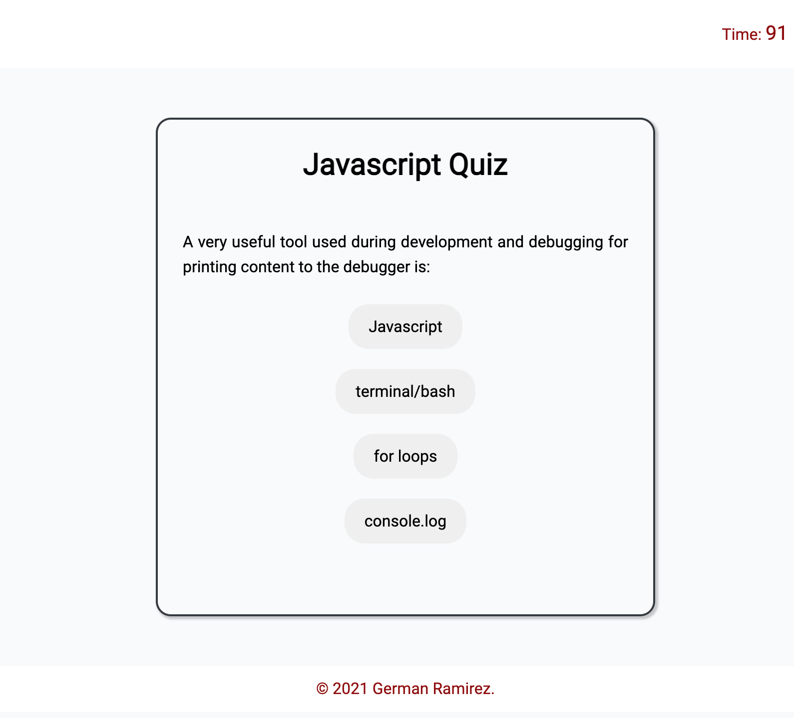

# 🖥 [Code Base](https://izaack89.github.io/code-base/)

This Quiz is to help you to understand Javascript so take the quiz and you can find on what topics you should review or you can demostrate that you are a Master.

## Quiz Elements

The goal of this project is to show that we can do a Project as Full-Stack cause on the backend I change the DOM by using Javascript depengin on what view is selected and with CSS I did a design that is responsive.

The quiz have 4 Views all created inside a javascript variable and all are displayed on the same page.

1. Main View

2.  Quiz View.- The quiz is defined on the code inside of a variable, what I do is to suffle the questions in order to not have the same order when the quiz is activated

    

    1.⏱ Timer.- I used to show the total time that the person have to answer the quiz and if the answer is correct the timer decrease by 10 seconds. Once the timer is 0 the Game is Over 

    2.✅,❌ Validation .- Here I can validate if the answer is correct according to the question

    

     3. Score count.- Once the validation is running I can count the possitive answers

3.  Game Over View.- On this view the user see the score and also is able to set their initials to save that on the localstorage

4. HighScores View.- On this section I display the information that is storage on the localstorage, I also can delete the infomration that are there by clicking the button "Delete Highscores"

## 📱 Responsive Design.- The quiz have a responsive design

## [Code Base GitHub Code](https://github.com/izaack89/code-base)

## Code Base References

- [sort](https://developer.mozilla.org/en-US/docs/Web/JavaScript/Reference/Global_Objects/Array/sort) - sort Function
- [List with Badge](https://developer.mozilla.org/fr/docs/Web/CSS/Layout_cookbook/List_group_with_badges) - List Layout with badge
- [createElement](https://developer.mozilla.org/es/docs/Web/API/Document/createElement) - createElement Function
- [buttons CSS](https://www.w3schools.com/css/css3_buttons.asp) - Style for buttons CSS
- [iteration Object](https://stackoverflow.com/questions/14379274/how-to-iterate-over-a-javascript-object) - How to iterate over Object
- [Box-shadow](https://developer.mozilla.org/es/docs/Web/CSS/box-shadow) - Box Shadow
- [ReadMe Markdowns](https://github.com/tchapi/markdown-cheatsheet/blob/master/README.md)

## Author

- **German Ramirez** - [GitHub](https://github.com/izaack89/)
